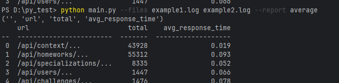
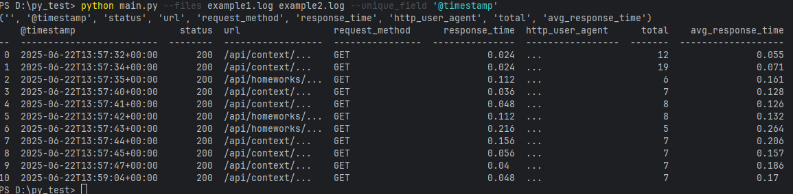
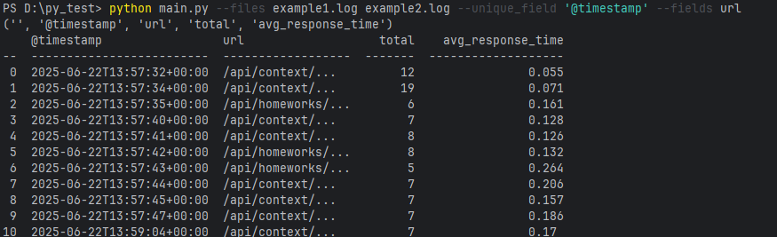
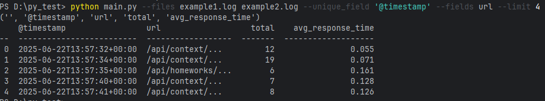
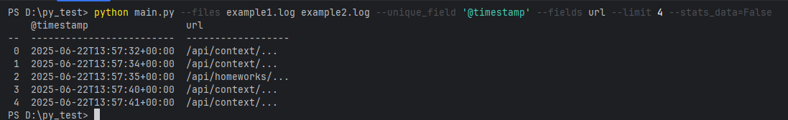

[README.md](https://github.com/user-attachments/files/21904483/README.md)
<h2>Обработчик лог-файлов</h2>
Скрипт для анализа и агрегации лог-файлов в формате JSON-like структур.

<b>Основные функции:</b>

Парсинг логов (parse_array_on_dict)

Обрабатывает строки логов в формате {key: value, key: value}

Группирует записи по указанному полю (по умолчанию url)

Вычисляет статистику: количество запросов, суммарное и среднее время ответа

Формирование отчета (get_normal_data)
Создает табличное представление данных

Поддерживает выбор полей для отображения

Добавляет статистические метрики (total, avg_response_time)

Объединение данных (merge_data)
Агрегирует данные из нескольких файлов

Обновляет статистические показатели при объединении

Параметры запуска

--files - один или несколько файлов для обработки

--report - тип отчета (поддерживается average)

--unique_field - поле для группировки (по умолчанию url)

--fields - список полей для отображения (all для всех полей)

--limit - ограничение количества строк в выводе

--stats_data - включение/выключение статистических данных

Обработка примера:

Пример с уникальным полем(поле по которому будет осуществлёна уникальная выборка):

Пример с полями:

Пример с лимитом:

Пример с статистическими данными:

Результат тестов:

